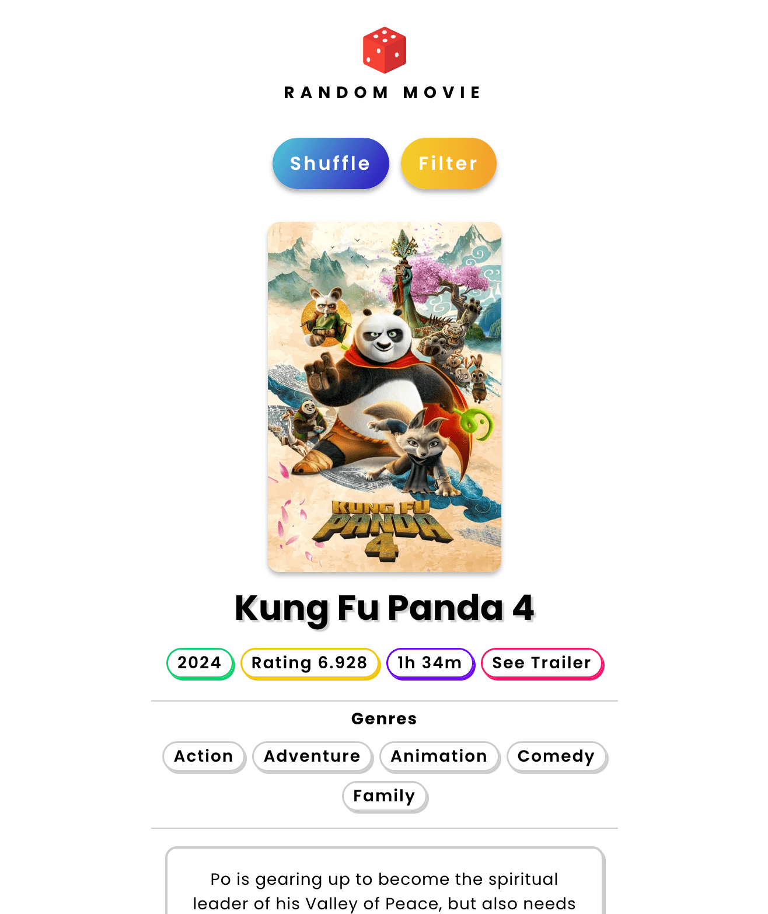

# 🍿 Random Movie

<p>
  
  <a href="https://github.com/emanuelchristo" target="_blank">
    
  </a>
  <a href="https://instagram.com/emanuel.christo" target="_blank">
    
  </a>
</p>

> A website which shows a random movie based on the filters set by the user.

### ⭐️ [Live website](https://random-movie.ecris.in/)

## 🏙 Screenshots



## 💿 Usage

```sh
# install dependencies
$ npm install

# serve at localhost:3000 or according to PORT env var
$ npm run start
```

## 🌳 Environment Variables

Set `PORT` env var to the port you would like to run the server on. If not set, it will default to port `3000`

## 🧑‍💻 Author

- [Emanuel Christo](https://ecris.in)
